# NovaTech Solutions

A responsive IT company website built with WordPress.

## Project Overview

NovaTech Solutions is a modern business website created as a final web development project. The website is fully responsive and was built using WordPress with Elementor and the Astra theme.

## Features

- Responsive Design
- Home, About, Services, Portfolio, Blog and Contact pages
- Contact Form using WPForms Lite
- Blog section with WordPress Posts
- Portfolio page
- Modern UI with Elementor
- Mobile, Tablet and Desktop support

## Technologies Used

- WordPress
- Elementor
- Astra Theme
- WPForms Lite
- LiteSpeed Cache
- Smush

## Screenshots

### Home

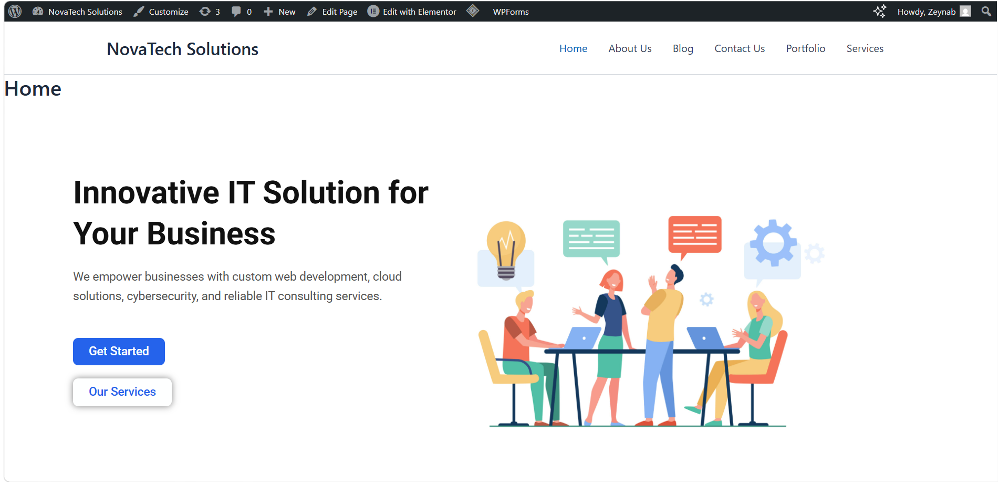
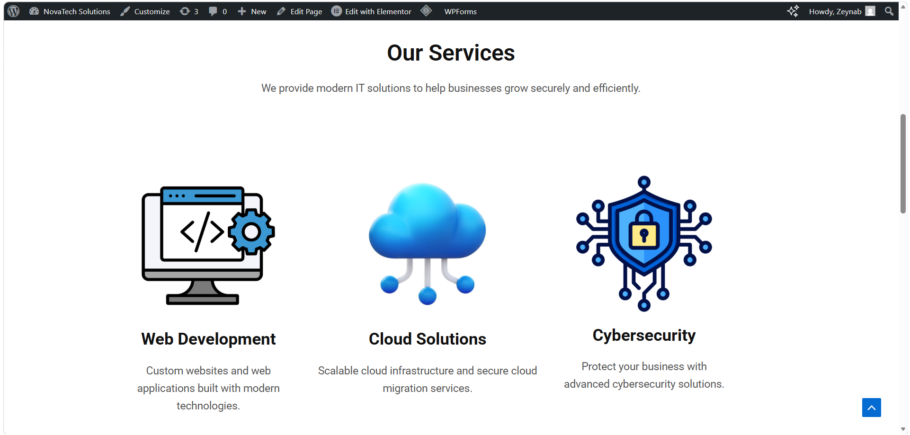
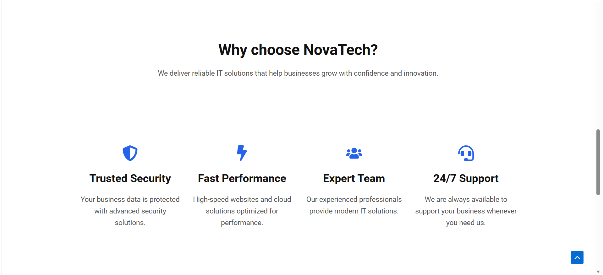
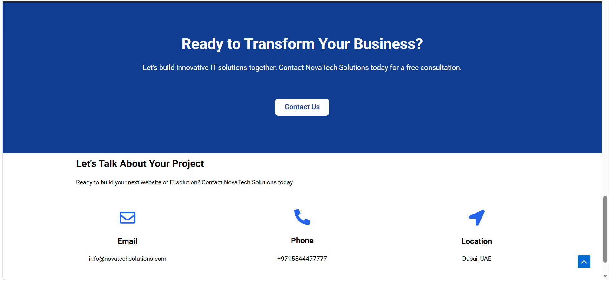

### About

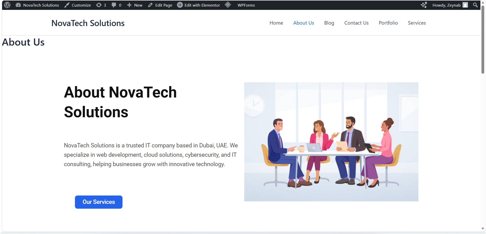
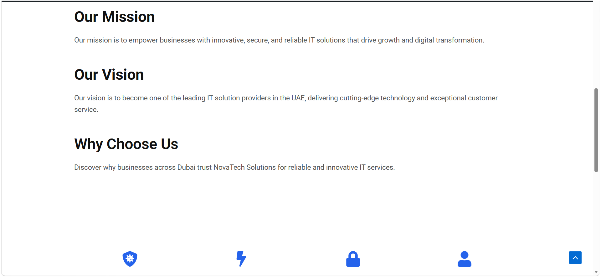
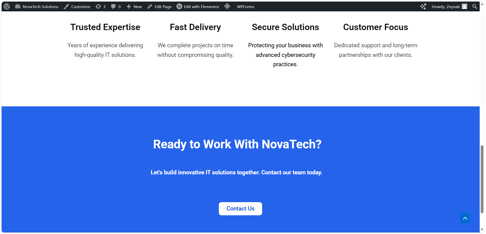

### Services

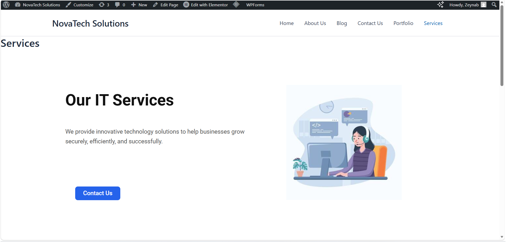
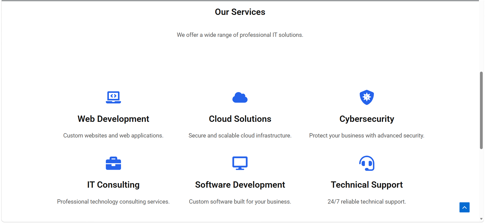
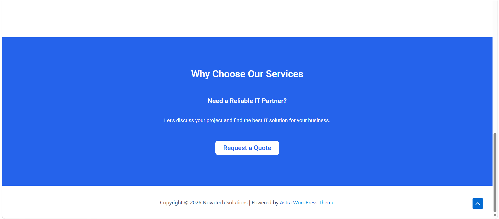

### Portfolio

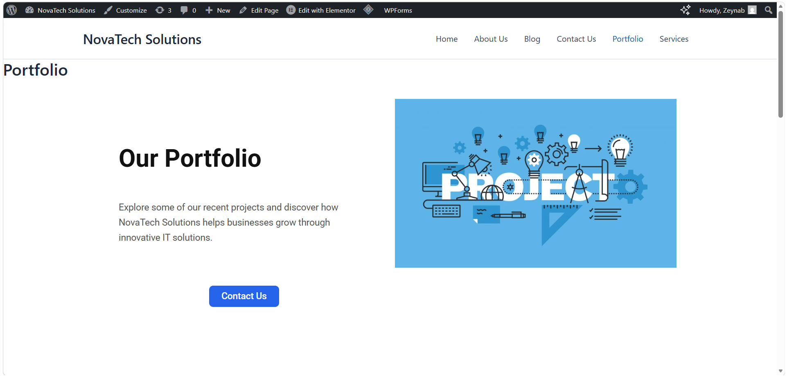
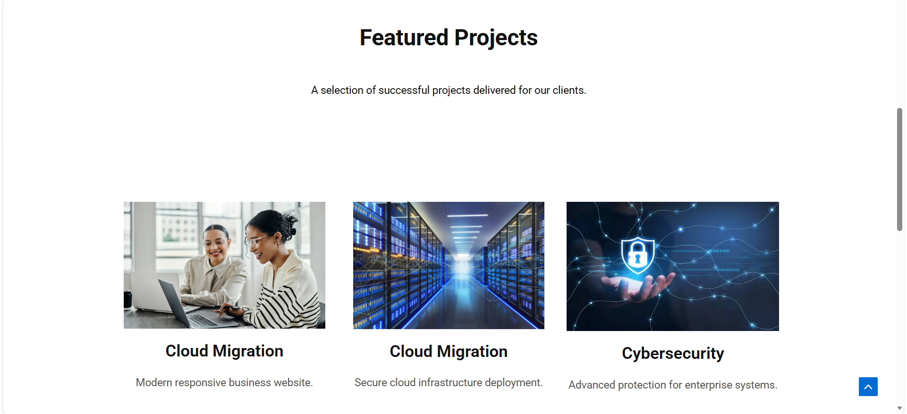
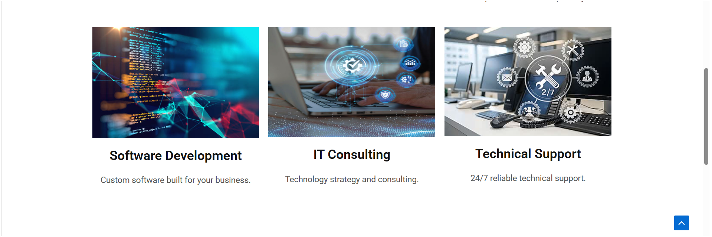
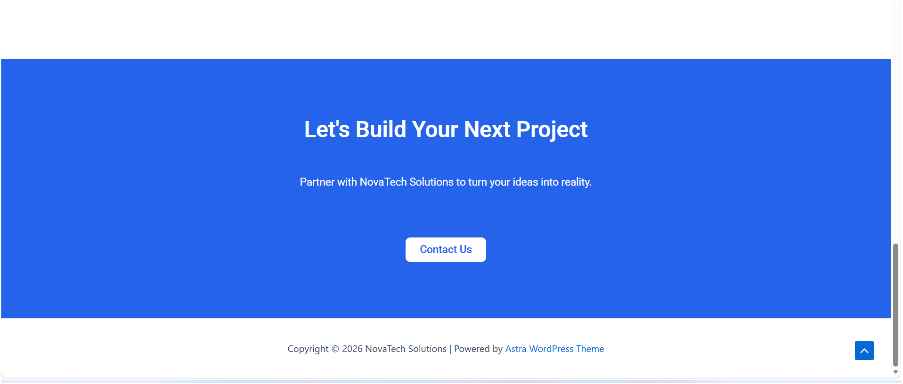

### Blog

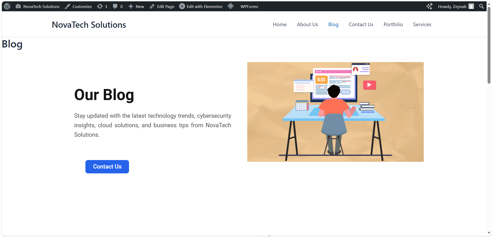

### Contact

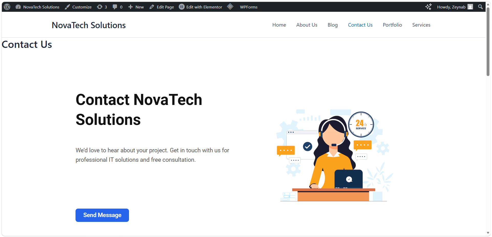
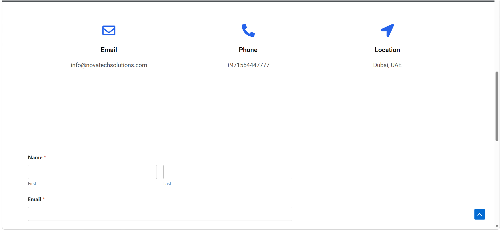
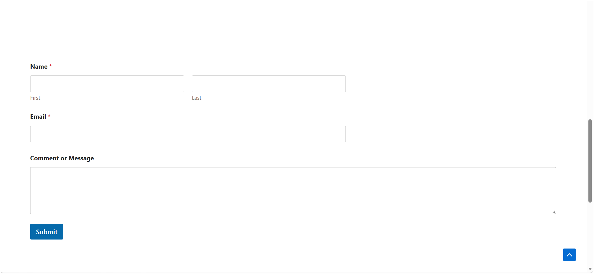
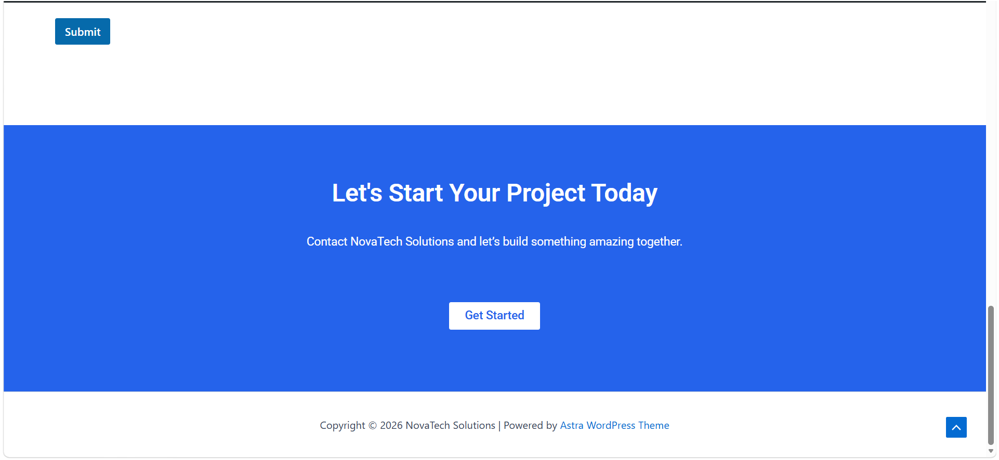

## Author

Created by Per Sonal
